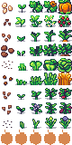

<!-- 
PROJECT LOGO
 

 

<h1>Farming in Scala</h1>

 About The Project

In its current state, our project allows a user to navigate a small map and plant seeds, which progress into fully grown plants. The user has a Minecraft like inventory system, that is displayed in the bottom left corne of the screen. Right now, the user spawns with a hoe, watering pot and seven different types of seeds which can be planted by simply pressing the space bar while the seed is selected. There is currently no use for the hoe and watering pot as we were mainly concerned with getting plant growth working. There is also no use for the plants once they have grown. Plants reach full gorth in less than a minute for testing purposes. Essentially, Farming in Scala is a simple demonstration of a map and character using pixel art.

 
There are is an assortment of bit art consisting of trees, plants, flowers, rocks, hay, tools, soil, houses, etc. decorating the map. A similar assortment is used for character and farming animations. The small map is divided into 4 quadrants which simplifies moving the camera to keep track of the player when they go out of the bounds of the current quadrant.

 
We ran into a lot of challenges with this project. To begin, all team members had little to no game development experience, so just finding out what tools to use was a challenge. We started out using a game library called Indigo, but soon realized it had very lackluster documentation, which made it very hard to use. We then switched to LibGDX which was a lot easier to use, but still a challenge because it was not designed to be used with Scala. LibGDX was designed for Java. We also had a lot of trouble with the language itself. In our opinion, Scala is a difficult language and is not a good language for game development. The functional programming elements of Scala were rarely useful and only made things more complicated. Nonetheless, we were able to figure it out and get the project to where it is.Our original idea was much more ambitious. We envisioned a game with mechanics and progression that resembled games like Animal Crossing and Stardew Valley. Unfortunately, we underestimated how difficult that would be and ran out of time.

 

 

 Built With

 
 

  
This is commented out. -->

## Project Members
Joshua Fenske, Tommy Trovinger, Lukas Karlsson, Sayre Peterson

## Prerequisites

The Prerequisites for running the game: Scala and Gradle.

First install Scala(sbt) using the directions for your operating system found on this page: https://www.scala-sbt.org/1.x/docs/Setup.html

Then install Gradle. Gradle runs on all major operating systems and requires only a Java JDK version 8 or higher to be installed. To check, run java -version:

Installing with a package manager
SDKMAN! is a tool for managing parallel versions of multiple Software Development Kits on most Unix-based systems.

$ sdk install gradle 7.6

Homebrew is “the missing package manager for macOS”.

$ brew install gradle

## Running the game
With sbt and gradle installed, navigate to the root of the directory on your system and run the command: ./gradlew desktop:run

<!--
## Usage
##
-->
